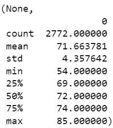

# Surfs Up

## Overview

I'll have to convince the board of directors to invest in my Surf & Shake Shop, serving surfboards and ice-cream in Hawaii. The key issue here is the weather optimal for such business and optimal month to start it.

### Temperature & Precipitation Plots

One can see from the plots below that June is preferable over December. It seems warmer and less rainy.

Period|Temperature|Precipitation
---|---|---
June||
December||
Whole Period||

### Temperature & Precipitation Statistics

Statistics tells the same, but June's victory is still not obvious enough.

temp/prcp|June|December|Whole Period
---|---|---|---
Temperature|||
Precipitation|||

### Box Plots

Box plots make your choice obvious. But it seems promising to try some other months, there may be some even warmer and drier.

## Summary

June is preferable in terms of both temperature and precipitation.

### Realized Suggestions

- Log bins/scale for precipitation. Linear scale does not provide any useful information.
- Box Plots as a key instrument for making decision. One can see the best period at once.
- Comparing June and December to the whole period. It stimulated us to look into other months.

### Suggestions to Realize

- look into other months
- compare stations' locations and our future shop location and use geographically most relevant data
- understand why there are gaps in the histograms, especially in the whole dataset hist; seems like stations round up temps and prcps or "prefer"/"avoid" some values
  - we could use value_counts to look for those gaps
- understand why data seem to be distributed as:
  - precipitation - gamma (https://journals.ametsoc.org/view/journals/atsc/76/11/jas-d-18-0343.1.xml)
  - temperature - normal
